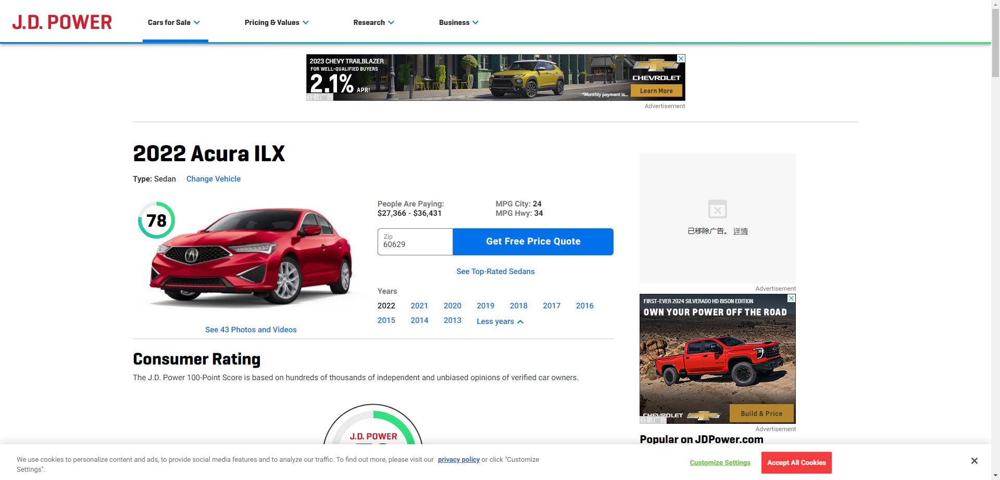

# Data query process and how this data is got?
Visit https://www.daas-auto.com/supermarket_data_De/109.html and https://www.jdpower.com/cars/2022/acura/ilx. These two websites provide professional data about cars in China and oversea markets. This paper manually collects data of 400 cars and use this data for training and testing. If in the future publication, more data is needed, just visit these two websites and get more data.

# Screen shot for these two professional websites and where data for cars can be found

# Step1
Paste in the url and visit this website.

# Step2
Search for a car or a series of cars here.

# Step3
You will see a llong list of data of a car. Find the eleven factor that is required in the data dictionary.

# How to use this notebook and the data?
First, go to the url provided and search for any car that can be included in this model. Remember to get all the data requeired in the model. This paper has also provided a sample collected by the author, which can be used in testing.

## Important
Data should include: Connector size;  Battery Size;  Distance Driven; model_year;  Range Buffer;  Driving Eff;  Inverter Eff;  Dispatch Time;  cylinders;  Maxpower;  weight

Then, download the model.py, this is a sample code used for analyzing the car information. Any code can be used, just make sure it's in line with SALib's requirement.

Lastly, rename your data file as "car_information.csv", name in the code can also be changed. You can run this data on your own computer!

### Brief introduction to SALib
SALib, or Sensitivity Analysis Library, is a powerful and versatile Python library used for conducting sensitivity analysis. Sensitivity analysis is a fundamental tool in data science and decision-making that helps assess the influence of input parameters on model outputs. SALib provides a range of techniques to perform global and local sensitivity analysis on models or simulations, making it valuable for a wide array of applications.

The library offers support for various sensitivity analysis methods, such as Sobol, Morris, FAST, and more. It allows users to quantify the importance of different input factors, detect nonlinear interactions, and understand the robustness of models. SALib is particularly useful in fields like environmental modeling, finance, engineering, and machine learning, where understanding parameter sensitivities and their impact is crucial.

SALib simplifies the sensitivity analysis process, making it accessible to both researchers and practitioners, and it is widely adopted in the data science community for enhancing model interpretability and decision-making.

### Data query and analysis process
In this piece of code, we directly import the data got from the website, which is linked at top of this article, and then analyze this piece of data using the model.py file in order to simulate the decision-making process of an AI in reality. We then analyze this decision-making process using morris imported from SALib, and we end up with a dot plot that covers all the parameters in a set, which shows us the most heavily weighted of all the parameters.

### Abstract

