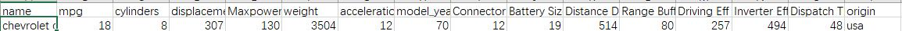

## Description 
- The dataset contains information on individuals' health parameters, with columns representing different attributes. These include Age, Sex, Chest Pain Type (ATA, NAP, ASY, TA), Resting Blood Pressure (RestingBP), Cholesterol levels, Fasting Blood Sugar (FastingBS), Resting Electrocardiographic Results (RestingECG), Maximum Heart Rate (MaxHR), Exercise-Induced Angina (ExerciseAngina), ST depression induced by exercise relative to rest (Oldpeak), ST segment slope (ST_Slope), and the presence or absence of Heart Disease (HeartDisease).
- Each row corresponds to a unique individual, providing a snapshot of their health profile. The data appears to capture diverse information such as age, gender, cardiovascular symptoms, and various physiological measurements. The dataset is likely intended for analysis to identify patterns or factors associated with the presence of heart disease.

## Data dictionary
| Variable        | Definition                                          | Description                                         | Frequency     | Range                | Unit        | Type      |
|-----------------|-----------------------------------------------------|-----------------------------------------------------|---------------|----------------------|-------------|-----------|
| Connector size  | Physical dimensions of an electronic connector      | Size of connectors                                  | Continuous    | 0,100                | cm^3        | Numerical |
| Battery Size    | Physical dimensions of a battery                    | Size of battery                                     | continuous    | 0,100                | cm^3        | Numerical |
| Distance Driven | Distance driven by the car                          | Distance driven by the car in km                    | continuous    | 0,1000               | km          | Numerical |
| model_year      | The first year the car is produced                  | The first year the car is produced in year          | Continuous    | 1900 to 2020         | year        | Numerical |
| Range Buffer    | Safety margin or reserved distance                  | Safety margin or reserved distance                  | Continuous    | 0,1000               | cm          | Numerical |
| Driving Eff     | Optimal fuel use and energy utilization             | Optimal fuel use and energy utilization             | Continuous    | 0,1000               | none        | Numerical |
| Inverter Eff    | Proportion between fual cost and energy             | Proportion between fual cost and energy             | Continuous    | 0,1000               | none        | Numerical |
| Dispatch Time   | Time needed to dispatch, similar to range buffer    | Time needed to dispatch in millicrosecond           | Continuous    | 0,1000               | ms          | Numerical |
| cylinders       | size of a cylinder                                  | size of a cylinder                                  | continuous    | 0,100                | cm^3        | Numerical |
| Maxpower        | Max power of the engine                             | Max power of the engine                             | Continuous    | 0,1000               | kwh         | Numerical |
| weight          | weight of a car                                     | weight of a car in kg                               | continuous    | 0,1000               | kg          | Numerical |

##Example

# Citation
Wang, Lei. “汽车参数配置_汽车参数配置查询_汽车参数配置库-达示数据.” Www.daas-Auto.com, 20 Sept. 2021, www.daas-auto.com/supermarket_data_De/109.html. Accessed 28 Nov. 2023.
Richard, Anderson. Car Information and Comparison. 7 Oct. 2022, www.jdpower.com/cars/2022/acura/ilx. Accessed 28 Nov. 2023.
### Abstract

