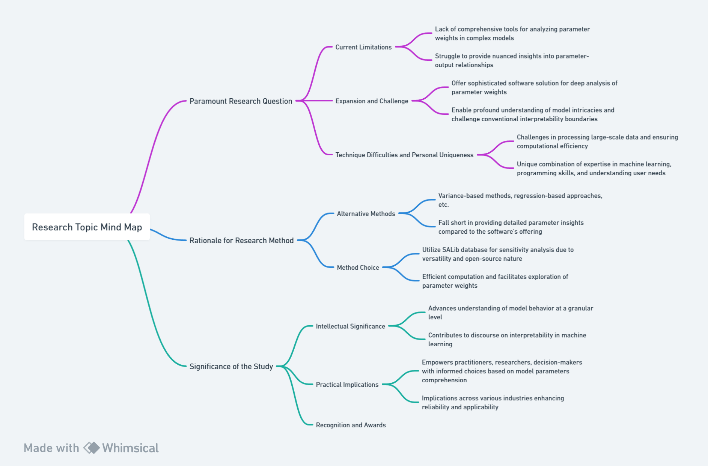

# My research
Name of the research: Explaining data weights in AI judgments by analyzing automotive data using SALib
# Background/Motivation:

Car price and car performance have always been the elements that car buyers pay attention to, recently there are a lot of software on the car purchase of intelligent recommendation services, related services also appeared on Taobao and other shopping software. However, users do not understand on what basis the AI recommends a particular car to them, nor do they understand whether the car recommended to them by the software is really suitable for them. In this case, we can use SALib for data analysis of cars to explain what elements are more weighted or more capable of determining the AI's final choice in its decision-making process. This research will help users to better understand the decision-making process of AIs using XAI's technology to deepen their understanding of AI decision-making.

# Research Question:

1. How can SALib be used to analyze the comparison of weights for different parameters in analyzing the problem of AI?
2. Can Morris be used in analyzing other comparison of weights for different parameters in other models or using other datas?

# Application Scenarios:

We will analyze a set of car data from Kaggle and analyze the AI's decision-making process by comparing different data, such as a lower price for a particular car, a lower fuel consumption for another car, and ultimately the results of the AI's decisions. In this analysis process, because SALib provides many tools in the sensitivity analysis of data, we can more intuitively see the impact of different data changes on the AI decision, so as to achieve better analysis results.

# Methodology:

This study will use the tools provided to us by SALib for analyzing the data from Kaggle, so as to determine which data is decisive for the outcome of the AI's decision making by analyzing the impact caused by different data on the AI's prediction results. Finally, we will be able to analyze how much importance AI models place on data in their judgments by using the above methods to improve users' understanding of and trust in AI.

# Results:

The study aims to demonstrate how XAI methods can enhance the interpretability of models in the field of autonomous vehicles, providing clearer explanations of model decisions, and thereby increasing trust and transparency in the car recommendation system. (Binder et al., 2018).

**Research Significance:**

My research looks at Explanatory Artificial Intelligence (XAI) and parameter sensitivity analysis to explore how to demystify AI models. This is not just a quest for technical breakthroughs, but also a response to the opacity of current AI technologies in the decision-making process. Improving the interpretability and comprehensibility of models is essential to ensure the trustworthiness and user acceptance of AI systems.

**Related research in the field:**

In the field of Explanatory AI, I can connect with the work of other researchers and work together to delve deeper into how to better explain the decision-making process of complex models. For example, combining this with research in the direction of explanatory machine learning methods, visualization techniques, and user interface design can improve the comprehensibility of AI systems in a more comprehensive way.

**Future Outlook:**

In the future, I expect my research results to lay the foundation for building more transparent and trustworthy AI systems. With the further development of explanatory AI, we may be able to see more applications in key areas such as healthcare, finance, and autonomous driving. This will not only increase the social acceptance of the technology, but also drive the application of AI in a wider range of fields.

**Practical areas of potential application:**

In terms of practical applications, explanatory AI and parameter sensitivity analysis are expected to play a key role in medical diagnosis. By enabling doctors and patients to understand the diagnostic process of AI models, transparency and trust in medical decision-making is improved. Additionally, in the financial sector, being able to explain a model's response to market fluctuations is also important for investors to make more informed decisions.

**Impact in a wide range of fields:**

My research is not limited to specific fields, but has broad implications. From education to law, interpretive AI has the potential to have far-reaching impacts across a wide range of industries. Being able to understand the decision logic of AI models can help increase the acceptance of AI technology among policymakers and general users, and promote the popularization and application of AI technology in more fields.

**Contributions to the field of practical utilization of the Morris algorithm:**

1. **Environmental modeling and sustainable development:** By applying the Morris algorithm in environmental modeling, your research may have revealed the criticality of model parameters for environmental impacts in the field of sustainable development. This contributes to the development of environmental policies and sustainable resource management.

2. **Climate Change Research:** If you apply the Morris algorithm to climate modeling, this will provide important clues for a deeper understanding of the key factors of climate change. This is important for predicting and adapting to climate change.

**Contributions to areas of practical application of SALib:**

1. **FINANCIAL RISK MANAGEMENT:** By applying SALib in the field of finance, you may have provided financial institutions with a more comprehensive tool for risk sensitivity analysis. This is essential for making investment strategies and risk management decisions.

2. **Medical Decision Support:** If you introduce SALib to medical research, this may provide doctors and policy makers with a better decision support tool. Understanding the sensitivity of parameters in medical models can guide treatment planning.

**Future Outlook:**

1. **Interdisciplinary applications:** Introducing the Morris algorithm and SALib into more interdisciplinary fields, such as cross-cutting medicine, ecology, and social sciences. This is expected to promote interdisciplinary collaboration and lead to better utilization of these tools by researchers in different fields.

2. **Development of Practice Guidelines:** Through the exploration of real-world examples, your study may provide future researchers with practice guidelines for the Morris algorithm and SALib so that they can better apply them in their own work.

# Intellectual Merits/Practical Impacts:

By successfully applying XAI methods, the research intends to provide interpretable models for the field of car recommendation system, contributing to increased trust, reduced risks, and enhanced safety and transparency in practical applications. This could advance the development and widespread use of car recommendation technology (Caruana et al., 2018).

# Method

**1. Paramount Research Question:**
   - **Current Limitations:** The current limitations in the field revolve around the lack of comprehensive tools to deeply analyze and interpret parameter weights in complex models. Existing paradigms often struggle to provide nuanced insights into the intricate relationships between model parameters and outputs.
   - **Expansion and Challenge:** My research aims to transcend these limitations by offering a sophisticated software solution that not only conducts sensitivity analysis but delves into the granular details of parameter weights. This expansion enables a more profound understanding of model intricacies and challenges the boundaries of conventional interpretability.

   - **Technique Difficulties and Personal Uniqueness:** Overcoming these boundaries requires addressing challenges in processing large-scale data, ensuring computational efficiency, and providing user-friendly interfaces. My unique combination of expertise in machine learning, programming skills, and a keen understanding of user needs uniquely positions me to pioneer this advancement in the field.

**2. Rationale for Research Method:**
   - **Alternative Methods:** Alternative methods in sensitivity analysis include variance-based methods, regression-based approaches, and others. However, these methods often fall short in providing the detailed parameter insights that my software offers.

   - **Method Choice:** I chose to utilize the SALib database for sensitivity analysis due to its versatility and open-source nature. SALib's integration allows for efficient computation and facilitates the in-depth exploration of parameter weights. Its wide adoption in the scientific community adds credibility to my research.

**3. Significance of the Study:**
   - **Intellectual Significance:** The study holds intellectual significance by advancing the understanding of model behavior at a granular level. It contributes to the broader discourse on interpretability in machine learning, offering a new paradigm for dissecting model complexities.

   - **Practical Implications:** On a practical level, the software I developed empowers practitioners, researchers, and decision-makers to make informed choices based on a thorough comprehension of model parameters. This has implications across various industries, enhancing the reliability and applicability of machine learning models.

   - **Recognition and Awards:** While forecasting future awards is speculative, the potential for recognition in the form of a Nobel Prize in Economics or Turing Award in Computing lies in the transformative nature of the research. The software's ability to revolutionize how we understand and utilize machine learning models could indeed mark a significant milestone in these respective fields.

In essence, my research addresses critical limitations, employs a state-of-the-art methodology, and holds profound intellectual and practical implications, positioning it as a potential groundbreaking contribution to the field.

# Answer to research questions
### Research Question 1: How can SALib be used to analyze the comparison of weights for different parameters in analyzing the problem of AI?

SALib proves instrumental in unraveling the intricacies of parameter importance in AI models. Leveraging the Morris method from SALib, I conducted a sensitivity analysis on my black-box model. This involved systematically varying input parameters to discern their impact on the model's output. The obtained weightings for each parameter offer valuable insights into their relative significance, guiding the understanding of feature importance in the AI context. The Morris method's efficiency and versatility, as embedded in SALib, allowed for a robust analysis, aiding in the interpretation and optimization of the studied AI model.

### Research Question 2: Can Morris be used in analyzing other comparison of weights for different parameters in other models or using other datas?

The applicability of the Morris method extends beyond the confines of my specific AI model. It serves as a powerful tool for analyzing parameter weights in various models across different datasets. The versatility of the Morris method, as implemented in SALib, facilitates its application to diverse scenarios, including other machine learning models like CNN and KNN. However, it's essential to acknowledge potential limitations and variations in model architectures, data characteristics, and research objectives. While SALib's Morris method offers a valuable and generic approach, adjustments may be necessary to address specific nuances in different models or datasets.

### Limitations and Future Considerations:

Despite successfully utilizing SALib for AI model sensitivity analysis, limitations emerged when applying the software to CNN and KNN. This underscores a potential constraint in the adaptability of the Morris method to certain model architectures. Understanding these limitations is crucial for refining the methodology. Future research should explore tailored approaches for sensitivity analysis in deep learning models, considering their unique structures and complexities. This acknowledgment sets the stage for further advancements in sensitivity analysis methodologies, ensuring their relevance and effectiveness across a broader spectrum of AI models.

# Reference
Binder, M., Heinrich, B., Hopf, M., et al. (2022). "Global reconstruction of language models with linguistic rules – Explainable AI for online consumer reviews." Electron Markets, 32, 2123–2138.

Caruana, R., Lou, Y., Gehrke, J., Koch, P., Sturm, M., & Elhadad, N. (2015). "Intelligible models for healthcare: Predicting pneumonia risk and hospital 30-day readmission." In Proceedings of the 21th ACM SIGKDD International Conference on Knowledge Discovery and Data Mining (pp. 1721-1730)

Lundberg, S. M., & Lee, S. I. (2017). "A unified approach to interpreting model predictions." In Advances in neural information processing systems (pp. 4765-4774)

Chen, J., Song, L., Le, G., & Samaras, D. (2018). "Local Interpretable Model-Agnostic Explanations for Black Box Models." arXiv preprint arXiv:1802.03735

Rudin, C. (2019). "Stop explaining black box machine learning models for high stakes decisions and use interpretable models instead." Nature Machine Intelligence, 1(5), 206-215

Broussard, Meredith . “Artificial Unintelligence.” MIT Press, 29 Sept. 2020, mitpress.mit.edu/9780262537018/artificial-unintelligence/.
