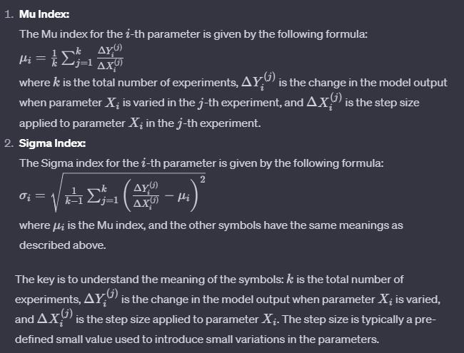

# Background and motivation
In modern society, more and more AI smart recommendations are starting to come into human life. For example, 大众点评 can implement recommendations for restaurants and attractions that are suitable for users. 探探 can recommend suitable candidates as relationship objects for users in real time. In addition to the above two software, there are also software such as soul, Baidu map and WeChat small program that use AI algorithms to recommend suitable choices for users. However, while feeling the convenience that AI brings to people, some people also question the recommendation mechanism behind AI algorithms.

For example, in a dating recommandation software, there are three men in a sample. All of them have their own advantages, which one will be recommanded?

This man is the richest in the dataset, but he is ugly and weak.

This man is the most handsome, but he is poor and weak.

This man is the strongest, but he is ugly and poor.

In the real world we need to consider more complex parameters as well as more complex situations, but to make this easy to understand, this article uses this simple case to explain the skepticism directed at AI recommendation algorithms.
In general, rich samples will be more likely to be selected because AI recommendation software will have a membership mechanism, and rich people will increase their chances of being recommended when they become VIPs. This reflects a kind of irrationality of AI recommendation, that is, the AI recommendation algorithm may not be able to recommend the target that the user wants to get the most.
In this paper, we will use the technique of XAI to observe this black-box AI recommendation model that may be irrational.

This study will likewise provide two different analytical scenarios. In the first analysis, this paper will only consider a few parameters in the dataset.
In the second analysis, this paper will consider more parameters in dataset and show the complexity comparison by comparing the difference between the two analysis cases.

"Why am I being recommended this thing?" It has become the question of more and more people. Some suspect that these recommended restaurants or attractions are in fact giving bribes to the software developers so that they can get a higher priority. Back in 2019 there were stories of businesses suggesting that if they didn't pay a fixed fee to the platform, they wouldn't get prioritized recommendations.

The source of this series of social unrest and mistrust is the opacity of the AI algorithms themselves, which creates these questions as people are unable to see the decisional process as the AI makes decisions and judgments.

In order to solve this problem, it is necessary to introduce the concept of XAI and a series of XAI algorithms, in this research, this paper will introduce the SALib package and Morris algorithm. This paper will provide an example of a solution to the above problem by analyzing the parameter weights of a sample model using the Morris algorithm.

# Brief introduction for the contents here
XAI is a new type of AI technology that explains AI's decisions and helps users better understand how and why AI makes decisions, so that customers can use AI output more transparently, clearly and effectively.

This study aims to first demonstrate the authors' understanding of XAI, and then to identify a real-world case study in which XAI is put to work.

The aim of this piece of research is to analyze the performance and value of the best-selling cars in the United States by using XAI to make a cost-effective analysis, thus providing a valid business analysis report for the automotive market. The study also aims to analyze the feasibility and advantages of putting XAI into financial analysis while studying the value for money. This paper uses SALib and firstly analyzes why SALib can be used to analyze financial issues and value for money analysis. This paper will introduce the advantages of SALib and show the reader the motivation, application areas and other important points of this paper.

The following is the literature section of this research, which will first introduce the definition of XAI and the research area of this paper.

# About SALib package and Morris algorithm applied in this research
In this paper, we will use the SALib package to analyze the price and performance of automobiles.The SALib package uses the Morris algorithm, an algorithm that allows us to implement sensitive artificial intelligence analysis. The next part of the paper will describe the reasons why Morris enables sensitive AI analysis.

First, there is the sampling strategy of the Morris algorithm, which does not analyze all the data, but rather samples a limited amount of data to make it more feasible for high-dimensional problems.

Second, for each parameter, in this case each item of data for the car, Morris puts ah consider one-dimensional effects (OAT) and overall effects, which are used to represent the direct and overall effects of parameter changes on the output, respectively. This suggests that Morris is able to more clearly represent the effect of each car parameter on the final output and is able to differentiate between the effects caused by different data.

Moving on to meta-analysis, Morris utilized meta-analysis to quantify the sensitivity of each parameter. This is a technique for estimating parameter sensitivities by looking at how the model's output changes under different parameter settings.
This paper then goes on to describe the advantages of using the Morris algorithm.

The first is computational efficiency, Morris provides a computationally efficient method of global sensitivity analysis, which is especially more credible for high-dimensional parameter spaces. Its sampling strategy and meta-analytic approach ensure this advantage.

Second is the sensitivity to parameter interactions. As mentioned earlier, Morris is able to separately analyze the impact of both individual parameters and the parameter as a whole on the overall results, which helps the user to understand the impact of different parameters on the final results.

The above is the reason why this paper adopts SALib package for data analysis, as well as the specific analysis of Morris algorithm used for SALib package.

To explain about the Maths formula behind Morris, refer to the graph or the official website of SALib: https://github.com/SALib/SALib

