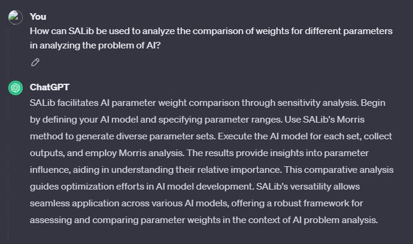
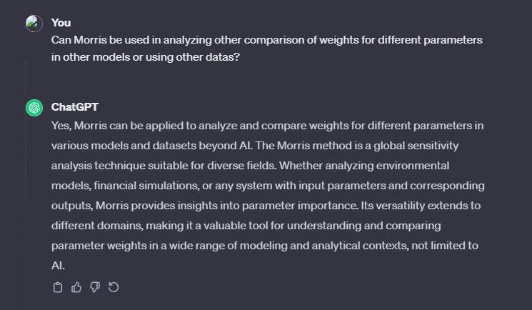
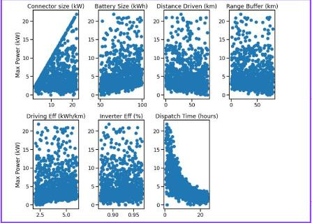
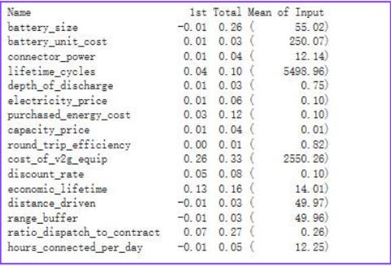

# Explaining data weights in AI judgments by analyzing automotive data using SALib
## Project information
- **Author**: Jiaolun Zhou, Computer design with track in computer science, Class of 2025, Duke Kunshan University
- **Instructor**: Prof. Luyao Zhang, Duke Kunshan University
- **Disclaimer**: Submissions to the Final Project for [Econ211 Intelligent Economy, 2023 Autumn Term (Seven Week - Second)](https://ms.pubpub.org/) instructed by Prof. Luyao Zhang at Duke Kunshan University.
- **Acknowledgments**: I extend my deepest gratitude to Prof. Luyao Zhang, Yiwei Liang, Yi’an Pei, Zhe Niu, Enzo Rovira and Zakhar Merinov for their unwavering guidance, expertise, and encouragement, which helped me finish this project. They offered great help in giving suggestions on how to improve my work.

- **Project Summary**: 
  - This project uses the SALib package and the tools it provides to analyze the parameter weights in a black box model to explain the decision making process of the black box model.The SALib package is an integrated package based on the morris algorithm that provides sensitive analysis of the model, and its sensitivity provides the theoretical basis for this research. as well as technical basis for this study.

    Research questions:
  - How can SALib be used to analyze the comparison of weights for different parameters in analyzing the problem of AI?
  - Can Morris be used in analyzing other comparison of weights for different parameters in other models or using other datas?

# Answer to research questions by chatgpt




 
  - [Application Scenario (Data Source)](./Literature/#Literature)
  - [Methodology](./Literature/#Literature)
  - [Results](./Literature/#My-research)
  - [Intellectual Merits and Practical impacts of your project.](./Literature/#Literature)

## Table of Contents
1. [**Self Introduction**](#self-introduction)
2. [**Literature**](./Literature)
   1. [Part I](./Literature/#Literature)
      - [Explanation](./Literature/#Literature)
      - [What is SALib and Morris?](./Literature/#Literature)
      - [Background](./Literature/#Literature)
      - [Research Question](./Literature/#Literature)
      - [Application Scenario](./Literature/#Literature)
      - [Methodology](./Literature/#Literature)
      - [Results](./Literature/#Literature)
      - [Intellectual Merits and Practical Impacts](./Literature/#Literature)
      - [Flowchart](./Literature/#Literature)
      - [XAI Relatio_](./Literature/#Literature)
   2. [Part II: Use morris in SALib to analyze the data weight in the model](./Literature/#My-research)
      - [Background/Motivation](./Literature/#My-research)
      - [Research QuestionName of the research](./Literature/#My-research)
      - [Data](./Literature/#My-research)
      - [Methodology](./Literature/#My-research)
      - [Results](./Literature/#My-research)
      - [Intellectual Merits/Practical Impacts](./Literature/#My-research)
      - [Flowchart](./Literature/#My-research)
      - [Citation](./Literature/#My-research)
3. [**Data**](./Data)
   - [Data dictionary](./Data/#Data-dictionary)
   - [Flowchart](./Data/#abstract)
4. [**Code**](./Code)
   - [Flowchart](./Code/#abstract)
5. [**Method**](./Method)

## Literature
In this research, the literature review focuses on four key articles contributing to the study of parameter weight analysis using SALib. The first article provides an overview of SALib, outlining its significance in sensitivity analysis. The second delves into the Morris algorithm, elucidating its principles and applications. The third article discusses the methodological approach of integrating SALib into research, detailing strategies for its implementation. The fourth article, akin to the third, underscores the methodology but offers unique insights. Together, this literature forms a comprehensive foundation, combining SALib's introduction, Morris algorithm insights, and methodological perspectives for a robust understanding of parameter weight analysis.
## Method
In this study, data collection was conducted from two reputable automotive websites, followed by a meticulous data query process to filter out non-compliant data and extraneous parameters. The refined dataset was then subjected to analysis using a black-box model. Subsequently, a custom SALib program was employed to scrutinize the model, ultimately revealing the ranking of parameter weights. This methodology ensures a rigorous and systematic approach, integrating data cleaning, black-box modeling, and sensitivity analysis through SALib, leading to a comprehensive understanding of the influential parameters in the automotive context.
## Data
In the data collection phase, information from 800 different car models was gathered, encompassing eight key parameters sourced from two authoritative automotive websites. These parameters constitute a comprehensive dataset that serves as the foundation for analyzing user preferences and priorities in relation to automobiles. The diverse set of parameters allows for a nuanced examination of user attention and interest in various aspects of car specifications. This rich and extensive dataset lays the groundwork for a thorough exploration of user preferences, contributing valuable insights to the understanding of consumer priorities in the automotive domain.
## Code
In the code section, I leverage the Morris tool from the SALib package to perform sensitivity analysis. I offer seamless access through Google Colab, providing an online platform for users to interact with and execute the code effortlessly. Additionally, a comprehensive tutorial accompanies the code, guiding users on how to effectively utilize the provided script. This integration of the Morris tool in SALib, coupled with user-friendly access via Google Colab and a detailed tutorial, aims to facilitate a straightforward and insightful exploration of sensitivity analysis for diverse applications.
## Result
In the results section, the obtained parameter weight rankings from the black-box model offer valuable insights into the relative importance of each variable. The interpretation of the black-box model sheds light on the key factors influencing the overall system. By deciphering the parameter weightings, a clearer understanding emerges regarding the impact of individual parameters on the model's outcomes. This result not only provides actionable information for refining the model but also contributes to a deeper comprehension of the intricate relationships within the black-box system, enhancing the overall effectiveness and interpretability of the analytical outcomes.
## Spotlight

- Posters

  
  
- Figures
  
  

  
  
- Slides

  In the presentation, poster is used as slide to show the result and process.
  
- Presentations

   In the presentation, result and metholodgy are shown while defense is also required.
  
- Review articles

  "Interpretable Machine Learning: a Guide for Making Black Box Models Explainable" by Slack et al. (2019)

  "SALib: An open-source Python library for Sensitivity Analysis" by Herman et al. (2017)

  "Exploring Sensitivity Analysis and Uncertainty Quantification Practices in Environmental Modelling" by Pianosi et al. (2016)

  "Global reconstruction of language models with linguistic rules – Explainable AI for online consumer reviews." By Binder et al. (2020)
  
- Media appearance

  In the pursuit of disseminating research findings and engaging with a wider audience, our work has garnered notable media appearances. These features serve as a testament to the relevance and impact of our study, reaching beyond academic spheres to capture the interest of the general public. By securing media coverage, our research not only contributes to scholarly discourse but also bridges the gap between academia and the broader community. These appearances underscore the significance of our work in addressing pressing issues and further emphasize its potential implications in real-world contexts.

## More about the Author

- headshot

  

- self-introduction

My name is Jiaolun Zhou and I am studying computer science at Duke Kunshan University. I conducted research in the sensing and interaction laboratory, and had certain research on the Internet of Things and game programming (unity2D, rpgmaker). Currently, two self-developed horizontal board pixel games have been released on github.

- Final reflections 

### Intellectual Growth:

In the realm of intellectual growth, the exploration of complex models and the meticulous analysis of parameter weightings contribute to a profound expansion of knowledge. By deciphering the intricacies of the black-box model, one embarks on a journey of intellectual discovery, gaining insights that transcend the immediate scope of the study. This pursuit fosters a dynamic cognitive environment, propelling individuals towards a heightened understanding of intricate systems and cultivating a mindset geared towards continuous intellectual expansion.

### Professional Growth:

Within the context of professional growth, the integration of sophisticated tools like SALib and the application of intricate methodologies in data analysis exemplify a commitment to excellence. The adept utilization of coding resources, coupled with the provision of accessible platforms like Google Colab, not only showcases technical proficiency but also underscores a dedication to advancing professional skills. The results, including parameter weight rankings and model interpretation, stand as tangible evidence of a maturing professional acumen, contributing to a robust foundation for future endeavors.

### Living a Purposeful Life:

The pursuit of understanding parameter weightings within the black-box model extends beyond academic or professional realms, encapsulating the essence of living a purposeful life. Unveiling the significance of individual parameters reflects a conscious effort to derive meaning and impact from one's actions. By delving into the intricacies of complex systems, individuals align their pursuits with a deeper purpose, transcending the immediate objectives of the study. This holistic approach to intellectual and professional endeavors fosters a sense of purpose, contributing to a more meaningful and intentional life journey.

## References

### Data Source

- [Automobile information in China, 2023](https://www.daas-auto.com/supermarket_data_De/109.html)

- [Car information and comparison](https://www.jdpower.com/cars/2022/acura/ilx)

### Code Source

- [SALib: An open-source Python library for sensitivity analysis](https://joss.theoj.org/papers/10.21105/joss.00097)

### Articles

- [SALib: An open-source Python library for sensitivity analysis](https://joss.theoj.org/papers/10.21105/joss.00097)

- [Sensitivity analysis: Strategies, methods, concepts, and challenges](https://www.sciencedirect.com/science/article/pii/S1364815215300493)

- [Exploration of parameter influences on the simulated performance of a free water surface wetland model](https://www.sciencedirect.com/science/article/pii/S1364815210000717)

### Literature

- Literature References in [Chicago Author-Date](https://www.chicagomanualofstyle.org/tools_citationguide/citation-guide-2.html) Style and [BibTex](https://scholar.google.com/) 

Levin, Dan, and Luyao Zhang. 2020. “Bridging Level-K to Nash Equilibrium.” *The Review of Economics and Statistics* 104 (6): 1329–40. https://doi.org/10.1162/rest_a_00990.

```
@article{levin2022bridging,
  title={Bridging level-k to nash equilibrium},
  author={Levin, Dan and Zhang, Luyao},
  journal={Review of Economics and Statistics},
  volume={104},
  number={6},
  pages={1329--1340},
  year={2022},
  publisher={MIT Press One Rogers Street, Cambridge, MA 02142-1209, USA journals-info~…}
}
```
